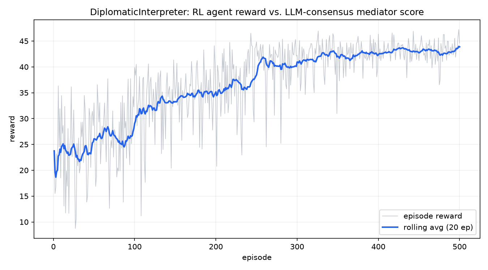

# genlayer-rl-diplomatic-interpreter

[](LICENSE)
[](https://www.python.org/)
[](https://genlayer.com)

Part of [GenLayer RL Agent Autonomy](https://github.com/luch91-org)
 - a family of independent repos that train reinforcement learning agents
against LLM-consensus reward functions on GenLayer. See the [org
profile](https://github.com/luch91-org/.github) for the
full picture; this repo is domain 4 of 4.

## What this is

A cross-community mediation environment. An off-chain RL agent plays a
mediator in a fixed dispute - a riverside parcel that one community wants
kept as a public park and the other wants rezoned for housing. Each step
the agent tables a compromise. An LLM mediator inside a GenLayer
Intelligent Contract estimates, on a single anchored 0-10 scale, how
likely **both** communities are to accept it, with a committee of
validators reaching consensus on that score. That estimate is the reward,
and a single **polarization index** then updates deterministically from it
 - an accepted compromise cools the dispute, a one-sided or inflammatory one
keeps it hot. The agent is never told which compromise is best; it learns
*diplomatic tact* from the scores - including that the right move depends on
how polarized the room currently is.

## The loop

```
   off-chain (your machine)                  on-chain (GenLayer)
 ┌───────────────────────────┐        ┌──────────────────────────────┐
 │  RL agent                 │  read  │  DiplomaticInterpreter        │
 │  - reads polarization +    │<─────  │  - holds polarization + log   │
 │    tabled-compromise log   │        │  - LEADER LLM scores the      │
 │  - drafts a compromise (ε-greedy)   │    compromise 0-10 (accept?)  │
 │  - updates Q-table         │  write │  - VALIDATORS agree via       │
 │    from the acceptance score│─────> │    eq_principle               │
 │                            │        │  - polarization updates       │
 │                            │ reward │    DETERMINISTICALLY from the │
 │                            │<─────  │    agreed score               │
 └───────────────────────────┘        └──────────────────────────────┘
```

**The reward function is immutable once deployed.** The agent optimizes
it; it cannot edit it, and it never sees the rubric. That constraint is
the safety property that makes this loop meaningful.

## Prerequisites

- Python >= 3.12 (`genlayer-py` needs it at import time).
- The [GenLayer CLI](https://docs.genlayer.com/developers/intelligent-contracts/tools/genlayer-cli)
  (`npm install -g genlayer`) only if you prefer `genlayer deploy` over
  the bundled pure-Python `agent/deploy.py`.
- A GenLayer network for `--env genlayer` (local Studio, hosted
  studionet, or a testnet). Not required for `--env mock`.

## Setup

```bash
git clone https://github.com/luch91-org/genlayer-rl-diplomatic-interpreter.git
cd genlayer-rl-diplomatic-interpreter
python -m venv .venv
source .venv/bin/activate   # .venv\Scripts\activate on Windows
pip install -r agent/requirements.txt
```

Lint and test:

```bash
black --check .
isort --check-only .
pytest tests/ -v
```

Train against the free, instant mock environment (default, no network):

```bash
python -m agent.train --env mock --episodes 500
python -m agent.plot
```

This writes `logs/training.txt`, `agent/q_table.json`, and
`docs/learning_curve.png`.

Deploy the contract and train against the real chain:

```bash
# Option A: GenLayer CLI (needs Node)
genlayer deploy --contract contracts/diplomatic_interpreter.py

# Option B: pure-Python deploy helper
python -m agent.deploy --chain studionet

# then, with the printed address:
python -m agent.train --env genlayer --chain studionet --address 0x... --episodes 3 --max-steps 5
```

## Sample training log

```
episode=1 reward=23.745 rolling_avg=23.745 epsilon=0.9900 reason='compromise #0: both-sides acceptance ~2.6 at low polarizatio'
episode=10 reward=34.434 rolling_avg=24.561 epsilon=0.9044 reason='compromise #5: both-sides acceptance ~7.8 at low polarizatio'
episode=50 reward=33.023 rolling_avg=26.087 epsilon=0.6050 reason='compromise #3: both-sides acceptance ~9.4 at medium polariza'
episode=100 reward=39.864 rolling_avg=29.055 epsilon=0.3660 reason='compromise #5: both-sides acceptance ~8.2 at low polarizatio'
episode=300 reward=42.208 rolling_avg=40.937 epsilon=0.0490 reason='compromise #5: both-sides acceptance ~9.4 at resolved polari'
episode=500 reward=44.599 rolling_avg=43.878 epsilon=0.0100 reason='compromise #5: both-sides acceptance ~9.0 at resolved polari'
Training complete: 500 episodes in 0.1s, env=mock, states_seen=4, final_rolling_avg=43.878, final_epsilon=0.0100
```

(Real output from `python -m agent.train --env mock --episodes 500 --seed
42`. Episode reward sums over 5 steps; divide by 5 for a per-step score - 
the rolling per-step average climbs from ~3.5 in early, mostly-random
episodes to ~8.8 once the policy converges. The converged policy is the
diplomatic-tact lesson: table the **strong detailed compromise (#3)** while
the dispute is hot (`high`/`medium` buckets), then switch to the **concise
consolidation (#5)** once it has cooled (`low`/`resolved`) - a brief
good-faith confirmation fits a settled dispute, but that same brevity reads
as dismissive while the room is hot, so the mediator scores it low there.
Episodes start from a random polarization (`--random-start`, on by default)
so every bucket is learned, which is what makes the policy robust when the
on-chain mediator's exact score nudges the dispute into a bucket the
fixed-start path would skip. Across a converged episode the polarization
index falls steadily toward the resolved range. Without `--seed` your exact
numbers will differ.)



## Verified live deployment

This exact contract has been deployed and exercised end-to-end against the
hosted GenLayer Studio network (`https://studio.genlayer.com/api`, chain
`studionet`), 2026-07-05, at:

```
0xA5cf174b2fDC77058C181435040121711312EE15
```

A full trained-agent episode ran live - 5 on-chain LLM-consensus steps, the
greedy policy tabling the **detailed** compromise while the dispute was hot
and switching to the **concise** consolidation once it cooled - committed at
[`logs/training_live_studionet.txt`](logs/training_live_studionet.txt):

```
step=1 bucket=high   action=draft#3 reward=7.0 polarization=0.55 elapsed=74s reason='Concrete compromise that gives A a real riverfront park and B a real m'
step=2 bucket=medium action=draft#3 reward=8.0 polarization=0.37 elapsed=69s reason='It concretely gives Side A a real riverfront park and Side B mixed-use'
step=3 bucket=low    action=draft#5 reward=7.0 polarization=0.33 elapsed=23s reason='Fair compromise that splits the difference between park and developmen'
step=4 bucket=low    action=draft#5 reward=8.0 polarization=0.26 elapsed=26s reason='It offers a concrete middle path by naming both a riverfront park and '
step=5 bucket=low    action=draft#5 reward=8.0 polarization=0.23 elapsed=26s reason='The statement offers a fair compromise by splitting the parcel. Howeve'
Live episode complete: 5 steps on studionet, episode_reward=38.0, per_step_avg=7.60, final_polarization=0.23
```

Every step is genuinely LLM-judged: the on-chain mediator scored each
compromise 0-10 and validators reached consensus on that score (no
`NO_MAJORITY`). The dispute **cooled monotonically from 0.80 to 0.23** - a
57% drop - as the mediator-scored drafts landed. The state-dependence is
real on-chain, not just a mock artifact: the agent's mock-trained policy
(detailed compromise while hot, concise consolidation once resolved)
transferred directly, and the deployed reward prompt honors it - the concise
consolidation scores ~6 while polarization is high (it reads as dismissive
of live grievances) and ~8 once the dispute has settled. Live scores are a
touch more conservative than the mock's (~7.6 vs ~8.5 per step) because the
real mediator rarely awards a perfect 10; the policy and the cooling are
identical.

> A note on getting here, in the spirit of the sibling repos' hard-won
> lessons. The **first** live episode exposed two bugs that offline testing
> structurally could not: (1) the mock-optimal path skipped the `medium`
> polarization bucket entirely, so it was never trained - and the live LLM's
> exact score dropped the dispute right onto it, where the agent then picked
> a garbage action. Fixed by training from random start temperatures so
> every bucket is learned on-policy. (2) On a slow validator set a pending
> `take_action` outlived the receipt wait, and the naive retry fired a
> second identical transaction - both landed and the round counter jumped by
> two. Fixed by giving a submitted transaction a grace window to land before
> ever resubmitting. A separate finding: an early template that *referenced*
> "the agreed split" scored badly because the mediator has no memory of a
> prior deal - reworded to a self-contained statement. Live testing caught
> all three.

The hosted Studio network is a shared sandbox that may be reset at any
time - if the address above stops resolving, redeploy with `python -m
agent.deploy --chain studionet` and substitute your fresh address.

## Repository layout

```
.
├── contracts/
│   ├── diplomatic_interpreter.py  # the Intelligent Contract (GenVM-only)
│   └── logic.py                   # loader: execs the real contract source, stubbed genlayer
├── agent/
│   ├── env.py                     # Env protocol + MockEnv + GenLayerEnv
│   ├── agent.py                   # tabular Q-learning + compromise templates
│   ├── train.py                   # python -m agent.train
│   ├── plot.py                    # python -m agent.plot
│   ├── deploy.py                  # python -m agent.deploy
│   └── requirements.txt
├── tests/
│   ├── test_contract.py
│   └── test_agent.py
├── docs/
│   ├── tutorial.md
│   └── learning_curve.png
├── logs/training.txt
├── CLAUDE.md
└── .github/workflows/ci.yml
```

See [docs/tutorial.md](docs/tutorial.md) for why the polarization update is
deterministic (a consensus requirement), why the mediator returns one
anchored number, how a free-text domain is discretized for tabular
Q-learning, and the GenVM storage/float rules.

## Versioning

Semantic versioning; first tag `v0.1.0-alpha`. Trained `agent/q_table.json`
is attached to each GitHub Release so a reviewer can load a working agent
without retraining.

## Contributing

Issues and Discussions are open. See the [org profile](https://github.com/luch91-org/.github)
for how this repo fits into the broader GenLayer RL Agent Autonomy project.
